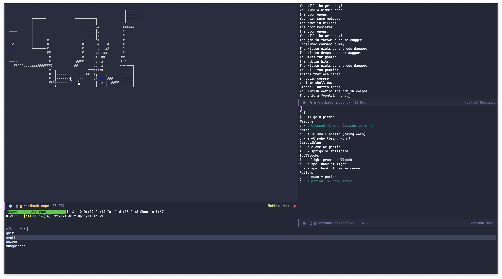
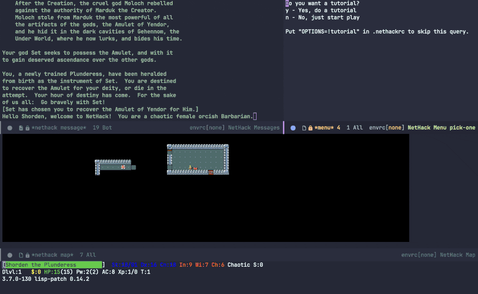

# `nethack-el`

What happens when you combine the most advanced, self-documenting, customizable,
extensible real-time display editor, Emacs, with nethack, the most elaborate
role-playing environment ever invented?

You get the most advanced, elaborate, self-documenting, customizable,
extensible, role-playing environment in the world!

All of the Elisp is GPLv3-or-later, and the patches are under the modified 3-clause BSD.

## Features

* Customizable keys
* Customizable colors
* Macros
* Event hooks
* Record and playback sessions (ttyrec)
* All the beauty that comes with Emacs

## Gallery


*Nethack 3.6.7 in graphical Emacs with DECGraphics*

<!-- generated with gif-screencast then `gifsicle --crop ... --scale ... --lossy 80 --colors 64 -O3 '#0-49'` -->

*Nethack 3.7 in `emacs -nw` with IBMGraphics ([lisprec](Lisprec) playback)*

<!-- generated with asciinema then `agg in.cast --font-family "JetBrainsMono Nerd Font Mono" out.gif` -->

*Nethack 3.7 in graphical Emacs with `(setq nethack-use-tiles "nethack")`*

## Project Status
I am semi-actively adding new features and fixing bugs as of September 2025.
I mostly work on things that affect how I play NetHack (i.e. my `nethackrc`), so please open an issue/PR if something doesn't work—it's likely I just don't use that feature and never ran into that particular issue.

> [!IMPORTANT]
> nethack-el currently only officially supports versions 3.6.7 and 3.7.0-WIP of vanilla NetHack.
> You are welcome to open issues when using nethack-el with modern versions of NetHack (including variants) but please do not open issues with versions of NetHack older than 3.6.7.


Previous repo: <https://github.com/be11ng/nethack-el>

Old website: <http://savannah.nongnu.org/projects/nethack-el>

## Usage
The `nethack` command is all you need for local play; if a patched nethack executable can't be found, you will be prompted to build it (see [Building](Building)).

### Remote NetHack
Nethack-el can connect to a server running NetHack with `nethack-remote` (note that as of the time of writing no major public servers use the lisp patch 🥲).
Running `nethack-remote` interactively provides a helpful completing read interface for the below scenarios and is the preferred way to launch a remote nethack game.

To connect to NAO:
```elisp
(nethack-remote "ssh -o SetEnv=DGLAUTH=username:password nethack@%s" "nethack.alt.org")
```
(The above example also works for Hardfought.)

Or over telnet:
```elisp
(nethack-remote "telnet -l username:password %s" "nethack.alt.org")
```

### Lisprec
Nethack-el sessions can be recorded by enabling `nethack-lisprec-record`; when finished with a session a .lisprec.gz file will be saved to disk.

lisprec(.gz) files can be played back in Emacs with the command `nethack-lisprec-playback`.
Supported features are
- Pause/resume (`C-c C-,`)
- Variable rate fast forwarding (i.e. "10 minutes 30 seconds" to fast forward 10 minutes and 30 seconds)
- Advance frame-by-frame

If you would like to convert a lisprec into a more conventional ttyrec, try this script:
```bash
#!/usr/bin/env bash

ttyrec -e "emacs -nw -L <nethack-el-dir> -l nethack --eval \"(progn (add-hook 'nethack-lisprec-playback-finished-hook #'kill-emacs) (nethack-lisprec-playback \\"$1\\"))\"" "${1%%.*}.ttyrec"
```
(If you don't care about preserving timings, I would recommend adding `(nethack-lisprec-fast-forward-until \`(,most-positive-fixnum 0 0 0))` to speed things up.)

### Tiles
If you're coming from the X11/Qt window port you may prefer playing with `(setq nethack-use-tiles "nethack")`, which draws the map with XPM images instead of text.

You can use tiles with variants other than vanilla NetHack, too: for example, for Slash'EM, first you would run
```bash
# can also be run interactively
emacs --batch -l nethack-el/nethack-gen-tiles.el --eval "(nethack-gen-tiles \"<slashem-src-dir>\")"
```
Next, ensure the resulting `slashem-tiles.el` is in your `load-path`, and then `(setq nethack-use-tiles "slashem")`.
If you play many different variants, consider adding a function to `nethack-map-mode-hook` that sets `nethack-use-tiles` to the correct tileset.

## Building

These instructions are known to work on \*NIX systems and have been lightly tested on Windows.

### Easy installation

* Install the Elisp sources (either from GitHub or MELPA)

  * Add the `nethack-el` folder to your Emacs load-path.

  * Make sure you have all of your dependencies installed.  You'll need `make`,
    `gcc`, `bison` or `yacc`, `flex` or `lex`, and the ncurses-dev library for
    your system.

    * On Windows you'll need MSYS2 with `mingw-w64-ucrt-x86_64-gcc` and `make` installed, and make sure `C:\msys64\usr\bin` is in `exec-path`.

> [!NOTE]
> nethack-el only supports NetHack 3.7.0 on Windows.

  * Play with `M-x nethack RET`. This should automatically detect if NetHack w/ lisp patch is installed, and if not will attempt to build it from source.

### Manual Build

* Download either `nethack-367.tgz` from <https://nethack.org> or `git clone https://github.com/NetHack/NetHack.git` (required for using NetHack-3.7 branch)

* Untar the package and apply the respective patch

  For example, if you were installing 3.6.7, you would do something like:

  ```
  $ tar xzf nethack-367-src.tgz
  $ cp enh-367.patch NetHack-NetHack-3.6.7_Released
  $ cd NetHack-NetHack-3.6.7_Released
  $ patch -p 1 < enh-367.patch
  ```

* Follow the instructions in `sys/*/Install.*` or `NewInstall.*`

  * This may be as simple as running `sys/unix/setup.sh` to copy the Makefiles.

  * For the 3.6.7/3.7.0 patch, included is a hints file under
    `sys/unix/hints/lisp` based on the default Linux one, which builds
    into wherever the `PREFIX` environment variable points to at runtime.  You
    may want to edit the `lisp` hints file before running something along
    the lines of:

    ```
    $ cd sys/unix
    $ vi hints/lisp
    $ sh setup.sh hints/lisp
    ```

* Compile (from the toplevel)

  * Following the instructions as outlined so far, that would be:

    ```
    $ cd ../..
    $ make all
    $ make install
    ```

* Install the Elisp sources

  * Edit the Makefile in the `nethack-el` directory to set the location of your
    Emacs.

  * Byte compile (not strictly necessary).

    ```
    $ cd .. # Or wherever nethack-el is located
    $ make all
    ```

  * Place the `*.elc` or `*.el` files in your load-path.

  * Add the following lines somewhere inside your `init.el`:

    ```elisp
    (autoload 'nethack "nethack" "Play Nethack." t)
    (setq nethack-program "/PATH/TO/PATCHED/nethack")
    ```

  * Play with `M-x nethack RET`.
